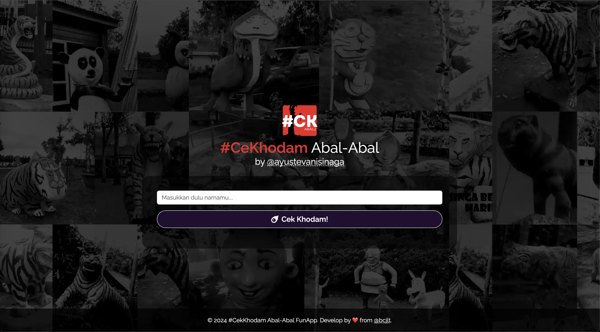

# CKhodam Abal2
Aplikasi web untuk mencocokkan nama pengguna dengan nama khodam yang unik. Menggunakan Express.js untuk backend dan Bootstrap untuk frontend.



## Fitur
- Memeriksa nama pengguna dan menghasilkan nama khodam unik.
- Menggunakan desain responsif dan tema gelap.
- Menghindari duplikasi nama khodam.

## Instalasi dan Penggunaan

### Prerequisites

- [Node.js](https://nodejs.org/) versi 14.x atau lebih baru.
- [npm](https://www.npmjs.com/) (termasuk dalam Node.js).
- [Git](https://git-scm.com/) untuk kontrol versi.

### Menjalankan Aplikasi Secara Lokal

1. **Clone Repository:**

   ```bash
   git clone https://github.com/bintangjtobing/ck-abal2.git
   cd ck-abal2
   ```

2. **Instal Dependensi:**

   ```bash
   npm install
   ```

3. **Jalankan Aplikasi:**

   ```bash
   npm start
   ```

   Aplikasi akan berjalan di `http://localhost:3000`.

### Menggunakan API
Aplikasi ini menyediakan API untuk mendapatkan nama khodam secara langsung.

## Endpoint:
```
GET /api/v1
```

## Query Parameters:
name: Nama pengguna yang ingin dicocokkan.
Contoh Permintaan:
```
curl "http://localhost:3000/api/v1?name=YourName"
```
## Contoh Respons:
```
{
  "khodamName": {
    "nama": "YourName-Naga Api Gunung Berapi",
    "tipe": "Naga",
    "asal": "Gunung Merapi"
  },
  "nama": "YourName-Naga Api Gunung Berapi",
  "tipe": "Naga",
  "asal": "Gunung Merapi"
}
```

### Deploy ke Heroku

1. **Instal Heroku CLI:**

   [Download dan instal Heroku CLI](https://devcenter.heroku.com/articles/heroku-cli).

2. **Login ke Heroku:**

   ```bash
   heroku login
   ```

3. **Inisialisasi Git (jika belum):**

   ```bash
   git init
   ```

4. **Buat File `Procfile`:**

   ```bash
   echo "web: node server.js" > Procfile
   ```

5. **Tambahkan dan Push ke Heroku:**

   ```bash
   git add .
   git commit -m "Initial commit"
   heroku create
   git push heroku main
   ```

6. **Atur Variabel Lingkungan (jika diperlukan):**

   ```bash
   heroku config:set VAR_NAME=value
   ```

7. **Akses Aplikasi di Heroku:**

   Aplikasi Anda akan tersedia di URL yang disediakan oleh Heroku.

## Kontribusi
Jika Anda ingin berkontribusi pada proyek ini, silakan ikuti langkah-langkah berikut:
1. Fork repository ini.
2. Buat branch baru untuk fitur atau perbaikan Anda.
3. Kirim pull request dengan deskripsi perubahan yang Anda buat.

## Lisensi
Proyek ini dilisensikan di bawah [MIT License](LICENSE).

## Screenshot
Berikut adalah tampilan aplikasi:


## Developer
- [@bcjlt](https://github.com/bcjlt)
## Supported by
- [@ayustevanisinaga](https://github.com/ayustevanisinaga)
```